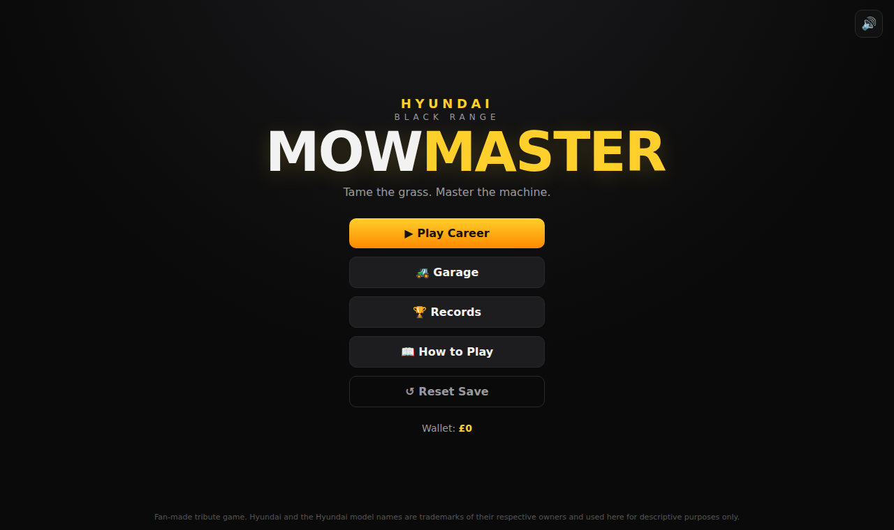
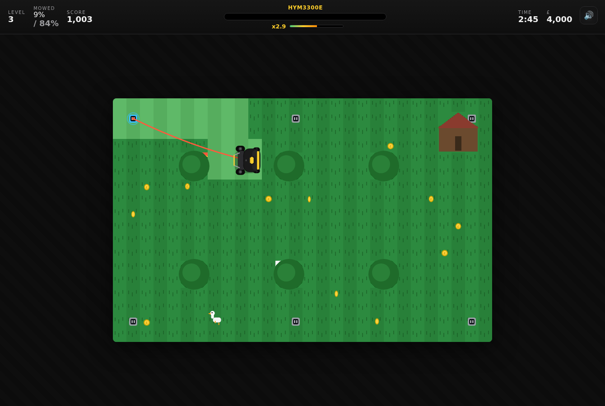
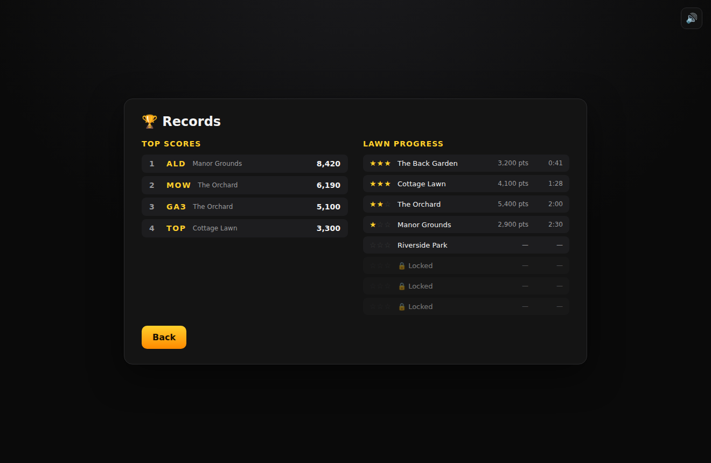

# 🚜 Hyundai Mow Master — Black Range Lawn Mowing Game

A complete, polished, browser-based arcade lawn-mowing game built around the
**real Hyundai Power Products lawnmower range**. Every machine in the game is an
actual Hyundai model, and **its real-world spec is turned into a difficulty
layer** — the corded mowers are tethered by a cable that only reaches so far,
the cordless mowers trade freedom for battery life, the petrol mowers are
powerful but thirsty, and the HYRM1000 robot never stops but has a tiny deck.

No build step, no dependencies, no binary assets — pure HTML5 Canvas + vanilla
JavaScript, with all sound synthesised at runtime via the Web Audio API.



## ▶ Play it

```bash
npx http-server -p 8080 -c-1   # then visit http://localhost:8080
```

Or simply double-click `index.html`.

## 🎮 How to play

- **Move:** `W` `A` `S` `D` or the **Arrow keys** (on-screen pad on touch devices).
- **Cut:** drive over uncut grass — wider decks cut more per pass and leave a
  striped finish. Keep cutting to build a **combo multiplier up to x5**.
- **Coins & power-ups:** grab £ coins and crates — ⚡ Turbo, ↔ Wide Cut,
  ⛽ Fuel, £ Cash.
- **Avoid:** trees, ponds, hedges, rocks, gnomes — and roaming **dogs** 🐕 and
  **geese** 🪿. Bumping anything stalls you and breaks your combo.
- **Stars ⭐:** up to 3 per lawn (finish / clean run / coins collected).
- **Records 🏆:** beat the top-10 **leaderboard** and enter your initials.

`P` / `Esc` pauses · 🔊 toggles sound · everything saves to `localStorage`.

## ⚙️ The spec *is* the difficulty

Each power type plays completely differently — straight from the real spec sheet:

| Type | Real trait | In-game challenge |
|------|-----------|-------------------|
| 🟡 **Corded (mains)** | The lead only reaches so far (e.g. the HYM3800E ships with a 10m cable) | **Unlimited power, but you're tethered to a wall socket.** Go too far and the cable pulls **taut** — you physically can't continue. **Re-plug** into another socket dotted around the garden, or fit the **🔌 Extension Cable** upgrade to reach further. *Use an extension, or switch sockets?* |
| 🟢 **Battery (cordless)** | Finite charge (~60 min on the HYM40Li330P) | Total freedom of movement, but the charge runs down — top up on a **⚡ charge pad**. |
| 🟠 **Petrol** | Big engine, big tank, but burns fuel | The most power, width and speed — but visit the **⛽ refuel pad** before the tank runs dry. |
| 🔵 **Robot (HYRM1000)** | Self-charging, but only an 18cm deck | Never runs out of power, but the tiny cut means **total coverage** is the real test. |

### The cable mechanic in detail
Corded mowers anchor to the nearest **wall socket** when you start. A live cable
is drawn from the socket to the mower; it sags when you have slack and turns
**red when taut**. To mow a far corner you must **drive over another socket to
re-plug**, or buy the **Extension Cable** in the Garage (+6 cells of reach on
every corded machine) so a single socket covers more ground. Short-cable mowers
are cheap and never run out — but planning your socket route is the puzzle.

## 🏁 The roster — real Hyundai Power Products mowers (9 machines)

| Model | Type | Real-world spec |
|-------|------|-----------------|
| **HYM3300E** | Corded · 33cm | 1200W mains, short lead — the free starter |
| **HYM3800E** | Corded · 38cm | 1600W, **10m long-reach cable**, rear roller, 40L |
| **HYM40Li330P** | 40V Cordless · 33cm | 40V 2.5Ah, ~60 min runtime, stripe roller |
| **HYM430SPE** | Petrol · 42cm | 139cc electric-start, self-propelled, 45L |
| **HYM460SP** | Petrol · 46cm | 139cc 4-in-1 self-propelled, 55L |
| **HYM480SPER** | Petrol Roller · 48cm | 139cc electric-start roller, big 70L box |
| **HYM510SPE** | Petrol · 51cm | 196cc, 1L tank, 4-speed self-propelled, 70L |
| **HYM510SPEZ** | Petrol Zero-Turn · 51cm | 196cc with razor-sharp zero-turn steering |
| **HYRM1000** | Robot · 18cm | 22.2V Li-ion, self-charging, 625m² |

*Specs are real Hyundai Power Products figures, balanced into game stats.*

Each machine is hand-drawn top-down to match its real-world look — the Hyundai
black-and-yellow livery, a centre-mounted petrol engine (with air filter, side
chute and exhaust), a battery pack with charge LEDs, a corded electric motor
with a cable inlet, or the compact blue-accented robot — plus a rear hard-top
grass box and a steel handlebar (or a rear striping roller on the roller
models). The same artwork is used for the garage thumbnails and the in-game
sprite so they always match.

## 🗺️ Career levels (8 gardens)

*The Back Garden · Cottage Lawn · The Orchard · Manor Grounds · Riverside Park ·
The Estate Gardens · Maze Hedges · The Grand Final* — with rising targets,
tighter time limits, more coins, more wildlife, and **wall sockets** placed for
corded play.


*The cable runs from the glowing socket to the mower and turns red when taut —
re-plug elsewhere or fit the extension cable to reach the far corners.*


*The Records screen — leaderboard plus per-lawn stars, best scores and times.*

## 🗂️ Project structure

```
index.html        screens (menu / garage / records / game / overlays)
css/style.css     all styling
js/audio.js       Web Audio engine — engine drone + SFX (no audio files)
js/mowers.js      the real Hyundai roster + spec-driven stats
js/levels.js      gardens (obstacles, coins, hazards, refuel pads, sockets)
js/game.js        routing, save, garage/shop, records, gameplay + cable logic
```

## 🛠️ Tech

Vanilla JS + Canvas 2D, zero binary assets (bar the README screenshots).
Verified end-to-end with a headless Playwright suite covering the roster/specs,
the garage and extension-cable purchase, the corded **cable-reach mechanic**
(HUD state, taut clamping, completing a lawn within reach via re-plugging),
battery/petrol HUD, coins, combos, scoring, stars and the leaderboard.

---

*Fan-made tribute. "Hyundai", "Hyundai Power Products" and the model names
referenced are trademarks of their respective owners and are used here
descriptively for a non-commercial fan game.*
